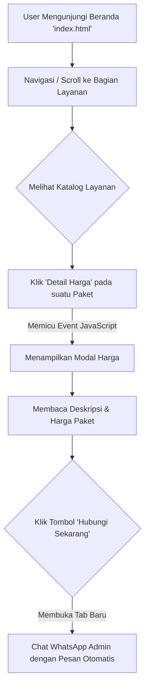

# FOOTWARE.LAB 👟✨

**"JANGAN ADA SEPATU KOTOR DIANTARA KITA"**  
FOOTWARE.LAB adalah platform layanan restorasi dan perawatan sepatu berstandar profesional. Melalui website ini, pelanggan dapat melihat profil layanan, melihat detail paket perawatan, dan langsung melakukan pemesanan layanan melalui integrasi WhatsApp.

---

## 🎯 Fitur Utama

1. **Responsive & Modern UI**: Desain antarmuka yang bersih, premium, dan sepenuhnya responsif untuk perangkat mobile maupun desktop.
2. **Katalog Layanan Interaktif**: Menampilkan berbagai paket perawatan (Cuci Sepatu, Cuci Tas, Cuci Topi, Suede Treatment, Unyellowing, Reglue Ringan).
3. **Price Modal Dinamis**: Fitur popup (modal) untuk melihat detail harga paket secara spesifik tanpa perlu berpindah halaman.
4. **Integrasi Langsung ke WhatsApp**: Memudahkan pengguna untuk memesan layanan dengan pra-format pesan yang terhubung langsung ke WhatsApp admin.
5. **Animasi Visual (Scroll Reveal)**: Menambahkan kesan dinamis dan elegan ketika user melakukan *scroll* pada halaman.

---

## 🛠️ Teknologi yang Digunakan

- **HTML5**: Struktur halaman utama yang semantik.
- **CSS3 (Vanilla)**: Penataan gaya atau *styling* kustom (*termasuk pembuatan grid layout dan responsivitas*).
- **JavaScript (Vanilla)**: Mengatur logika interaksi *Price Modal*, *Scroll Reveal*, pengubah status navigasi mobile, dan konversi harga ke format Rupiah.
- **Font Awesome**: Ikon visual yang digunakan pada fitur dan navigasi.
- **Google Fonts**: Tipografi modern menggunakan font keluarga **'Plus Jakarta Sans'**.

---

## ⚙️ Diagram Alur Pengguna (Workflow)

Berikut adalah ilustrasi alur pengguna dari melihat halaman layanan hingga tahap memesan melalui WhatsApp.



---

## 🚀 Cara Menjalankan Project (Setup Instructions)

Karena project ini dibangun sepenuhnya dengan teknologi statis murni (Frontend), Anda tidak memerlukan server backend khusus untuk menjalankannya secara lokal.

1. **Clone atau Unduh Project**:
   Pastikan seluruh file project sudah berada pada penyimpanan lokal Anda.
2. **Siapkan Kebutuhan Gambar**:
   Pastikan folder `images/` terisi dengan gambar-gambar terkait (profil, katalog layanan, dsb.) sesuai urutan file pada `index.html`.
3. **Jalankan Secara Lokal**:
   - Jika Anda memiliki ekstensi **Live Server** di VS Code, cukup klik kanan pada `index.html` lalu pilih *"Open with Live Server"*.
   - Alternatif lain, Anda cukup mengklik dua kali *(double-click)* pada file `index.html` dan buka dengan browser favorit Anda (Chrome, Edge, Firefox, Safari).

---

## 📂 Struktur Direktori

```text
FOOTWARE.LAB/
│
├── images/               # Direktori aset gambar untuk ilustrasi dan paket
├── index.html            # Halaman utama dan landing page
├── style.css             # Penataan gaya kustom untuk keseluruhan website
├── style.css.backup      # File cadangan (backup) styling
├── script.js             # Logika interaktivitas website (Modal, animasi scroll)
└── README.md             # Dokumentasi project (File ini)
```

---

## 📞 Info Kontak

Untuk konsultasi atau menjadwalkan layanan FOOTWARE.LAB secara komprehensif, Anda dapat menghubungi tim kami pada jam **12.30 - 22.00 WIB**:

👉 **[Hubungi WhatsApp di sini](https://wa.me/6285126446219)**

---
*Dibuat untuk kelancaran ekosistem perawatan sepatu di FOOTWARE.LAB.*
